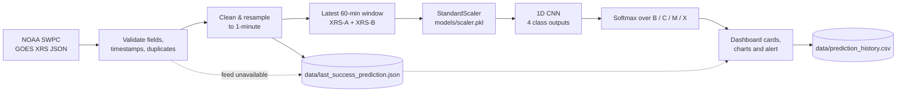
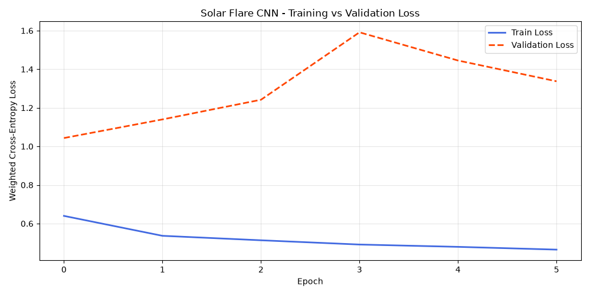
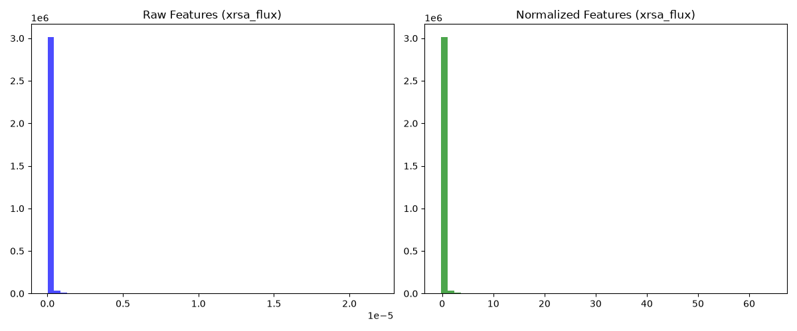

# Solar Flare Prediction Dashboard

**Nowcasting and next-hour flare forecasting from live GOES X-ray flux, with a 1D CNN.**

[](https://www.python.org/)
[](https://streamlit.io/)
[](https://pytorch.org/)
[](https://services.swpc.noaa.gov/json/goes/primary/xrays-1-day.json)
[](https://solar-flare-prediction-xrexehawlkmvueretyrj8t.streamlit.app/)

**Live app →** <https://solar-flare-prediction-xrexehawlkmvueretyrj8t.streamlit.app/>
*(free Streamlit Community Cloud instance — if it has gone to sleep, the first visit takes about 30 seconds to wake)*

This dashboard reads the **two GOES X-ray Sensor channels** (XRS-A 0.05–0.4 nm and XRS-B 0.1–0.8 nm) at one-minute cadence, feeds the most recent **60-minute window** through a 1D convolutional neural network, and reports the **flare class expected in the next hour** — alongside what is happening right now. It keeps working when NOAA is unreachable, and it teaches a first-time visitor how to read every number on the screen.

---

## Table of contents

1. [What it does](#what-it-does)
2. [Architecture](#architecture)
3. [The GOES flare scale](#the-goes-flare-scale)
4. [Features](#features)
5. [Screenshots and artifacts](#screenshots-and-artifacts)
6. [Quickstart](#quickstart)
7. [Project structure](#project-structure)
8. [How a prediction is made](#how-a-prediction-is-made)
9. [Model card](#model-card)
10. [Configuration reference](#configuration-reference)
11. [Data sources](#data-sources)
12. [Reliability: what happens when NOAA goes down](#reliability-what-happens-when-noaa-goes-down)
13. [Deploy it yourself](#deploy-it-yourself)
14. [Troubleshooting](#troubleshooting)
15. [Roadmap](#roadmap)
16. [Data attribution and licence](#data-attribution-and-licence)

---

## What it does

| Question an operator asks | Where the dashboard answers it |
| --- | --- |
| What is the Sun doing right now? | **Current Flux** card + log-scale flux chart with C/M/X threshold lines |
| What is expected in the next hour? | **Predicted Flare Class** card with softmax confidence |
| How likely is a serious event? | **M/X forecast watch** (combined M + X probability) |
| Is the data feed healthy? | **Status Panel**: connection, source, satellite, last NOAA update, model, refresh countdown |
| Has the model changed its mind? | **Recent Flare Events** table and the **Prediction History** tab |
| What do these numbers even mean? | **Solar Flare 101** tab, plus the primer under the title |

The dashboard is designed for **glanceability first**: observed facts and model forecasts are always visually separated, so nobody mistakes a prediction for a measurement.

---

## Architecture



Every stage is a separate module under `src/`, so the data source can be swapped without touching inference or UI code:

| Layer | Module | Responsibility |
| --- | --- | --- |
| Ingest | `src/live_data.py` | NOAA SWPC fetch, retries, schema and sanity validation |
| Prepare | `src/preprocess.py` | Cleaning, 1-minute resampling, scaler loading, window slicing |
| Infer | `src/predict.py` | Tensor shaping, CNN call, class mapping, `PredictionResult` |
| Serve | `app.py` | Layout, theming, auto-refresh, cards, tabs |
| Explain | `src/education.py` | GOES scale, live marker, flux decoder, reading guide |
| Present | `assets/style.css`, `assets/mobile.css` | Theme, components, responsive and motion layers |

---

## The GOES flare scale

Flares are ranked by **peak X-ray flux in the 0.1–0.8 nm band**, in watts per square metre. Every letter is one decade — exactly 10× stronger than the previous one:

| Class | XRS-B flux (W/m²) | What it means | Typical effect |
| --- | --- | --- | --- |
| **A** | 10⁻⁸ – 10⁻⁷ | Quiet background | None |
| **B** | 10⁻⁷ – 10⁻⁶ | Quiet to slightly active | Subflare activity only |
| **C** | 10⁻⁶ – 10⁻⁵ | Small flare | Weak shortwave radio fades on the sunlit side |
| **M** | 10⁻⁵ – 10⁻⁴ | Medium flare | Brief HF blackouts (R1–R2), possible radiation storm |
| **X** | ≥ 10⁻⁴ | Large flare | Long HF blackouts (R3+), radiation storm and CME risk |

The number after the letter is the position *inside* the decade: **M5.0 = 5.0 × 10⁻⁵ W/m²**. The **Solar Flare 101** tab renders this table, a live marker showing where the Sun sits right now, and an interactive decoder you can drag across the whole A-to-X range.

---

## Features

**Live monitoring**
- 60-second auto-refresh via `st.fragment(run_every=...)`, with a `streamlit-autorefresh` fallback and a manual **Refresh now** button.
- NOAA JSON validation before anything reaches the model: required fields, parseable timestamps, non-negative flux, duplicate removal, empty-response handling.
- Log-scale flux chart with C/M/X reference lines and a highlighted latest sample.

**Prediction**
- 1D CNN over a 2 × 60 tensor (both X-ray channels, 60 one-minute steps).
- Per-class softmax probabilities, confidence, and the observed class derived from NOAA thresholds.
- Charts: probability distribution per class, plus a prediction history table.

**Resilience**
- Any exception falls back to the last successful prediction in `data/last_success_prediction.json`, and the status panel turns red rather than the page erroring out.
- Cached predictions are reused when the underlying NOAA update has not changed, so reruns never double-log.

**Interface**
- **Native Streamlit light/dark theming** driven by CSS variables, so every custom component follows the theme.
- **Responsive ratio engine**: ultra-wide, cinematic 21:9, short laptop, portrait, tall phone, landscape phone and ultra-narrow breakpoints, plus safe-area insets and dynamic viewport units.
- **Premium motion layer**: staggered card entrances, table row cascades, hover sheen, animated heading rules — all disabled automatically under `prefers-reduced-motion`.
- **Themed boot splash** on first load, drawn entirely in CSS, gone in under three seconds.
- **Skeleton first paint**: after the splash, a shimmering layout placeholder is shown until the session's first prediction exists, so a cold or freshly woken container never presents a blank page. Later 60-second refreshes render straight from cache and skip it.
- **Solar Flare 101 education tab**: GOES scale bar with a live marker, class table, interactive flux decoder, a per-panel reading guide, an honest limitations section, NOAA R/S/G hazard table and a glossary.
- A collapsed **"New here? Solar flares in 60 seconds"** primer sits under the title, so newcomers get oriented without disturbing the operational view.

**Engineering**
- `src/` separation of concerns; `config.py` as the single source of truth for paths, thresholds and cadence.
- Cache stamps keyed on file mtime and size, so model, scaler and data changes invalidate Streamlit caches automatically.
- Rotating file log at `logs/dashboard.log` with a mirrored stream handler.
- `assets/_css_ratio_check.html` — a dev harness that renders the real stylesheets in eight device viewports (32:9 → portrait phone) to catch layout regressions.

---

## Screenshots and artifacts

Dashboard captures belong in [`docs/screenshots/`](docs/screenshots/) — that folder has a 60-second capture recipe (one command plus three crops). The image tags are already wired below; publishing is a one-line uncomment once the PNGs exist.

<!-- Uncomment after adding the PNGs to docs/screenshots/
<p align="center">
  
</p>
<p align="center">
  
</p>
<p align="center">
  
</p>
-->

Model and data artifacts that ship with the repository:

| Training curve | Class distribution |
| --- | --- |
|  |  |

The class distribution is the single most important chart for interpreting the model: quiet classes dominate the training windows, which is exactly why B/C recall is reliable and X-class recall is not.

---

## Quickstart

```bash
# 1. Clone
git clone https://github.com/sandilya-bit/solar-flare-prediction.git
cd solar-flare-prediction

# 2. Environment (Python 3.9+)
python -m venv venv
source venv/bin/activate          # Windows: venv\Scripts\activate

# 3. Dependencies
pip install -r requirements.txt

# 4. Run
streamlit run app.py
```

Open <http://localhost:8501>. The first load is slower — it downloads the NOAA feed, warms the model and builds a prediction; later refreshes are near-instant.

**Nothing else to configure.** The trained checkpoint (`models/solar_flare_cnn.pth`), the fitted scaler (`models/scaler.pkl`) and the cleaned GOES CSV fallback (`data/goes_xrs_1min_clean.csv`) are committed on purpose so a fresh clone runs offline out of the box.

> Prefer a hosted instance? The current Streamlit Community Cloud deployment is linked at the top of this page. Free instances sleep when idle, so the first visit can take ~30 seconds to wake.

---

## Project structure

```
solar-flare-prediction/
├── app.py                        # Streamlit entry point: layout, theming, auto-refresh, tabs
├── config.py                     # Paths, thresholds, cadence — single source of truth
├── requirements.txt
├── assets/
│   ├── style.css                 # Sections 1-7: theme, components, responsive ratio engine
│   ├── mobile.css                # Phone/tablet layout, touch targets, safe areas
│   └── _css_ratio_check.html     # Dev harness: renders the UI CSS at 8 device viewports
├── src/
│   ├── live_data.py              # NOAA SWPC fetch + validation
│   ├── preprocess.py             # Cleaning, 1-min resampling, scaler, window slicing
│   ├── predict.py                # Inference, class mapping, PredictionResult
│   ├── model_loader.py           # CNN architecture, weights, model summary and accuracy
│   ├── charts.py                 # Plotly flux and probability charts
│   ├── alerts.py                 # Alert policy and flare class colours
│   ├── history.py                # prediction_history.csv persistence
│   ├── education.py              # Solar Flare 101 content and GOES scale widgets
│   └── utils.py                  # Logging, formatting, cache stamps
├── data/
│   ├── goes_xrs_1min_clean.csv         # Bundled fallback so the app runs offline
│   ├── prediction_history.csv          # Append-only prediction log (last 200 rows)
│   └── last_success_prediction.json    # Last good prediction + 360-sample chart window
├── models/
│   ├── solar_flare_cnn.pth       # Trained 1D-CNN weights (~270 KB)
│   └── scaler.pkl                # StandardScaler fitted on the training split
├── scripts/
│   ├── build_scaler.py           # Rebuild scaler.pkl from the GOES CSV
│   └── create_test_files.py      # Generate quiet/C/M/X sample windows in tests/
├── docs/                         # Training curve, class distribution, screenshots/
└── tests/                        # quiet / c_class / m_class / x_class sample CSVs
```

---

## How a prediction is made

1. **Fetch** — `xrays-1-day.json` from NOAA SWPC, with retries and HTTP error handling.
2. **Validate** — required fields present, timestamps parseable, flux non-negative, duplicates dropped, empty responses rejected.
3. **Clean** — map to the `xrsa_flux` / `xrsb_flux` schema, clamp negatives to `NaN`, forward-fill up to 60 samples, resample to a strict 1-minute grid.
4. **Window** — take the latest 60 minutes (the exact shape the model was trained on). Fewer than 60 clean rows raises a clear error instead of feeding a partial window.
5. **Scale** — apply the pre-fitted `StandardScaler` to both channels.
6. **Infer** — reshape to `(1, 2, 60)` and run the CNN under `torch.no_grad()`.
7. **Map** — argmax over the four outputs, then the A-class rule: if the B output wins while the *observed* flux is still A-level, display A.
8. **Persist** — append to `prediction_history.csv` (de-duplicated by timestamp) and overwrite `last_success_prediction.json` with the prediction plus the chart window.
9. **Render** — cards, charts, alert, status panel, then repeat on the next refresh.

---

## Model card

| Property | Value |
| --- | --- |
| Type | 1D convolutional neural network (PyTorch) |
| Input | 2 channels × 60 one-minute steps (XRS-A, XRS-B), standardised |
| Architecture | `Conv1d(2→16)` → `Conv1d(16→32)` → `Conv1d(32→64)`, each with kernel 3, BatchNorm, ReLU and `MaxPool1d(2)`; optional extra `Conv1d(64→128)`; then `Flatten` → `Linear(448→128)` → `ReLU` → `Dropout(0.6)` → `Linear(128→4)` |
| Output | Softmax over **B, C, M, X**; A is derived from the B output plus the observed class |
| Scaling | `StandardScaler` fitted on the 70% training split of sliding windows (`scripts/build_scaler.py`) |
| Forecast horizon | 60 minutes (`PREDICTION_WINDOW_MINUTES`) |
| Device | CPU is sufficient (~270 KB checkpoint); CUDA is used automatically when present |
| Explainability | Per-class probabilities and observed-vs-predicted separation, surfaced in the UI |

### What this model cannot do

- **Confidence is not precision.** It is the softmax value of the winning class, and models trained on imbalanced data are frequently overconfident. Read "90%" as *the model strongly prefers this class*, not as a 90% hit rate.
- **X-class recall is the weakest link.** Quiet classes dominate the training windows (see the distribution chart), and the rare large events are the ones that matter most.
- **Flux only.** No magnetograms, no EUV imagery, no active-region complexity — so the model cannot see the magnetic configuration that ultimately decides flare size.
- **Flares only.** It says nothing about coronal mass ejections, solar energetic particles or geomagnetic storms, which is where most infrastructure risk actually lives.
- **Feed gaps hurt.** Missing NOAA minutes are forward-filled for up to 60 samples, which flattens the window and damps the model's response.

---

## Configuration reference

Everything below lives in `config.py`.

| Setting | Default | Purpose |
| --- | --- | --- |
| `APP_TITLE` | `Solar Flare Dashboard` | Page title and heading |
| `REFRESH_INTERVAL_SECONDS` | `60` | UI refresh cadence and prediction cache TTL |
| `HISTORY_MINUTES` | `60` | Number of one-minute samples fed to the CNN |
| `PREDICTION_WINDOW_MINUTES` | `60` | Forecast horizon stamped on each result |
| `DATA_SOURCE` | `live_noaa_json` | Default entry selected in the sidebar |
| `NOAA_GOES_XRAY_JSON_URL` | `.../goes/primary/xrays-1-day.json` | NOAA SWPC endpoint |
| `CLASS_NAMES` | `A, B, C, M, X` | Classes shown in the UI |
| `CNN_OUTPUT_CLASSES` | `B, C, M, X` | Classes the network actually predicts |
| `SATELLITE_NAME` / `SATELLITE_STATUS` / `GOES_VERSION` | GOES-R series | Status panel labels |
| `MODEL_CANDIDATES`, `SCALER_CANDIDATES`, `DATA_CANDIDATES` | `models/`, `data/` | Priority-ordered search paths |

| Path | Written by | Contents |
| --- | --- | --- |
| `data/prediction_history.csv` | dashboard | Prediction log, de-duplicated by timestamp, capped at 200 rows |
| `data/last_success_prediction.json` | dashboard | Last good prediction + 360-sample chart window for offline mode |
| `logs/dashboard.log` | `src/utils.py` | Rotating log (1 MB × 5) |

---

## Data sources

Switch with the **Data source** radio in the sidebar:

| Option | Key | Notes |
| --- | --- | --- |
| Live NOAA JSON | `live_noaa_json` | Default. Real-time SWPC feed with retries and validation |
| Local CSV | `local_csv` | Uses `data/goes_xrs_1min_clean.csv` — fully offline |
| Latest local NetCDF | `local_netcdf` | Scans `data/**/*.nc`; requires `xarray`, which is **not** in `requirements.txt` |

Raw NetCDF archives and the preprocessed training arrays are intentionally **not** committed (see `.gitignore`), which keeps the repository under a few megabytes while still shipping everything the running app needs.

---

## Reliability: what happens when NOAA goes down

1. The JSON fetch is retried with HTTP error handling.
2. Failures are logged to `logs/dashboard.log` with the exception attached.
3. The UI shows an explicit **Live Data Unavailable** error plus a warning naming the timestamp of the last good prediction — it never silently shows stale data as current.
4. If no previous prediction exists yet, the page explains that the next refresh will retry.
5. On recovery, the status panel returns to **online** and the next prediction is logged.

---

## Deploy it yourself

The app is a single Streamlit service with **no secrets to configure** — NOAA's endpoint is public. Everything the build needs is already committed:

| File | Why it is there |
| --- | --- |
| `requirements.txt` | `--extra-index-url .../whl/cpu` so pip installs CPU-only PyTorch instead of the multi-gigabyte CUDA wheel |
| `.streamlit/config.toml` | Dark theme matching the dashboard, minimal toolbar, usage stats off |
| `runtime.txt` | Pins Python 3.12 so every wheel resolves |
| `models/`, `data/` | Checkpoint, scaler and fallback CSV so a fresh clone runs immediately |

### Streamlit Community Cloud — free, about two minutes

1. Sign in at <https://share.streamlit.io> **with GitHub** (OAuth).
2. **Create app** → *Deploy a public app from GitHub*.
3. Repository `sandilya-bit/solar-flare-prediction`, Branch `main`, **Main file path** `app.py`.
4. Optional: **Advanced settings → Python version** → `3.12`.
5. **Deploy.** The first build takes 3–6 minutes and then prints your URL:
   `https://<your-name>.streamlit.app`.
6. Rename it: app menu (**⋮**) → **Settings → General → App URL**.

Every later `git push` to `main` redeploys automatically, which is the easiest way to publish updates.

### Free-tier behaviour worth knowing

- **It sleeps when idle.** The next visitor waits ~30 seconds while the instance wakes; subsequent requests are fast.
- **The filesystem is ephemeral.** `data/prediction_history.csv`, `data/last_success_prediction.json` and `logs/` reset on every rebuild or wake. The dashboard degrades gracefully, but history does not persist — move it to a hosted database if you need durability.
- **Memory is capped (~1 GB class).** CPU inference on a 270 KB checkpoint is trivial, so this app fits comfortably; a second heavy model would not.

### Keeping it permanently awake (no wake-up screen)

Community Cloud hibernates an app after **12 hours without traffic** — and a visit counts as traffic, so no database or paid plan is involved. This repository ships the ready-made job at [`docs/keepalive-workflow.yml`](docs/keepalive-workflow.yml): it **visits the app every 6 hours**, comfortably inside that window.

It sits in `docs/` rather than `.github/workflows/` because GitHub rejects any push that creates a file under `.github/workflows/` unless the pushing credential carries the `workflow` scope — and this repo is pushed with a token that does not. Move it into place one of two ways:

1. **No token changes** — through the web UI: *Add file → Create new file*, path `.github/workflows/keepalive.yml`, paste the body from `name:` down, commit.
2. **With the `workflow` scope** on your token:
   ```bash
   git mv docs/keepalive-workflow.yml .github/workflows/keepalive.yml
   git commit -m "Activate the keep-alive workflow" && git push
   ```

| Need | Do this |
| --- | --- |
| App URL changed (renamed subdomain) | Repo → **Settings → Secrets and variables → Actions → Variables** → new variable `APP_URL`. The workflow prefers it over the built-in default |
| Keep-alive without GitHub (or without touching the repo) | A free [UptimeRobot](https://uptimerobot.com/) HTTP monitor on the same URL, hourly — same effect, plus email alerts when the app really is down. This is the zero-setup option: works the moment the app exists |
| A hard guarantee | Remove the concept of sleeping: run the same `streamlit run app.py` on an always-on host such as an Oracle Cloud Always Free ARM VM (behind Caddy/Nginx), or mirror it to a Hugging Face Space, whose free idle window is longer than Community Cloud's |

Two honest caveats. Keep-alive **prevents** sleep; it does not reliably *wake* a sleeping app, because the sleep screen wants a human click — so keep the interval well under 12 hours. And GitHub can delay scheduled runs during busy periods, so treat this as "rarely sleeps" rather than "never sleeps". If the workflow ever reports a 4xx, the app URL is wrong and needs the `APP_URL` variable above.

### Alternatives, also free

Full comparison, per-host steps and the caveats that actually bite (idle windows, instance-hour quotas, bandwidth caps, custom domains) live in **[docs/deployment.md](docs/deployment.md)** — including a `Dockerfile` that works on Hugging Face Spaces, Render, Fly.io or a plain VM, a Render blueprint, and the no-server architecture for a deployment that can never sleep.

**Want it to literally never sleep?** On any always-on box (Oracle Always Free, a home server, a VPS) the whole deploy is:

```bash
cp .env.example .env        # set DOMAIN to your hostname
docker compose up -d --build
```

`docker-compose.yml` runs the dashboard plus **Caddy**, which gets and renews an HTTPS certificate for that hostname automatically — no certificate commands, no reverse-proxy tuning, and WebSocket upgrades (which Streamlit cannot work without) just work.

| Host | Result | Notes |
| --- | --- | --- |
| **Hugging Face Spaces** (Streamlit SDK) | `https://<user>-<space>.hf.space` | Same GitHub flow; custom domains are a paid feature |
| **Render** free web service | `https://<name>.onrender.com` | Supports a custom domain for free, but spins down when idle (~1 min cold start) |
| Shared PHP hosts (InfinityFree, iFreeDomains, …) | — | Cannot run Streamlit: no long-running Python process, no WebSockets, no pip |

---

## Troubleshooting

<details>
<summary><strong>Scaler not found (models/scaler.pkl)</strong></summary>

Generate it from the cleaned GOES CSV:

```bash
python scripts/build_scaler.py
```
</details>

<details>
<summary><strong>No CNN model found</strong></summary>

`resolve_inputs()` searches `MODEL_CANDIDATES` in order: `models/flare_model.pth`, `flare_model.pth`, `models/solar_flare_cnn.pth`, `solar_flare_cnn.pth`. Place the checkpoint at one of those paths.
</details>

<details>
<summary><strong>No fallback GOES CSV data found</strong></summary>

The local-CSV source and the offline path expect `data/goes_xrs_1min_clean.csv`. Restore it from the repository or point `DATA_CANDIDATES` at your own export.
</details>

<details>
<summary><strong>Need at least 60 clean rows</strong></summary>

The input CSV has too many gaps after cleaning. Use a longer export, or pick a different source in the sidebar.
</details>

<details>
<summary><strong>Model Summary shows "Not recorded in artifact"</strong></summary>

Training/validation accuracy is recomputed from `data/cnn_dataset_splits.npz`, which is not committed. Supply that file (or the `X_train`/`Y_train` arrays) to populate the tab; the rest of the dashboard is unaffected.
</details>

<details>
<summary><strong>NetCDF source raises an import error</strong></summary>

Install `xarray` (`pip install xarray`) or switch to the CSV source.
</details>

<details>
<summary><strong>Auto-refresh is not running</strong></summary>

The app prefers `st.fragment(run_every=...)` (Streamlit ≥ 1.37) and falls back to `streamlit-autorefresh`, warning in the sidebar if neither is available. `pip install streamlit-autorefresh` for older versions.
</details>

---

## Roadmap

- **Precursor panel** — XRS short/long hardness ratio, `dF/dt` and rolling z-scores, the classic X-class precursors already present in the two channels.
- **Calibration and skill** — temperature scaling, reliability curves and a scoreboard (POD, FAR, TSS/HSS) against a persistence baseline.
- **Alerting** — webhook/Telegram/Discord notifications for M- and X-class triggers, with de-duplication and quiet hours.
- **Durable history** — move the prediction log to a hosted database so it survives redeploys.
- **Panel labelling** — the "Last 24 hours" chart plots the latest 360 one-minute samples (6 hours) and the "6-hour" probability is derived from the next-hour run; both labels should match their math.
- **Richer inputs** — magnetograms, EUV imagery and active-region complexity, which is where real forecast skill lives.

---

## Data attribution and licence

- **X-ray flux data:** NOAA Space Weather Prediction Center, GOES XRS 1-day JSON (`services.swpc.noaa.gov`). NOAA data is in the public domain; attribution is appreciated.
- **Model and scaler:** trained by this project on GOES XRS 1-minute windows; the CNN architecture lives in `src/model_loader.py`.
- **Flare class definitions:** NOAA/SWPC GOES X-ray flare classification.
- **Code:** no licence file is included yet — add one (MIT or Apache-2.0 are both fine) before reusing this code in a published work.
